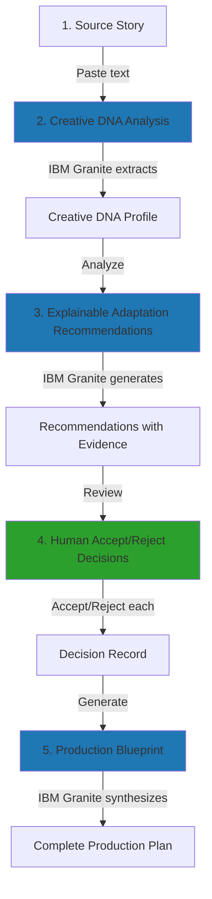
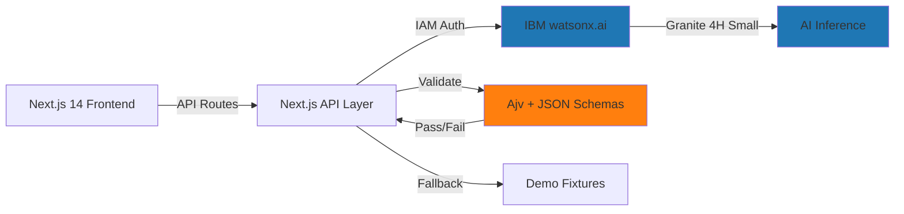

# Prism

**An AI-powered adaptation studio that helps creators transform source stories into production-ready short-film blueprints while preserving human creative control.**

[](LICENSE)
[](https://nextjs.org/)
[](https://www.typescriptlang.org/)
[](https://www.ibm.com/watsonx)

---

## The Problem

Traditional generative AI tools for creative adaptation often produce outputs that:

- **Skip creator intent**: They generate content without understanding the creator's vision or the source material's unique DNA
- **Ignore tradeoffs**: They make creative decisions without explaining the benefits and risks of each choice
- **Lack traceability**: They provide no evidence linking recommendations back to the source material
- **Remove human agency**: They present final outputs without giving creators meaningful decision points

This creates a "black box" problem where creators receive adaptation suggestions without understanding *why* those choices were made, *what* might be lost, or *how* to make informed decisions about their story.

## The Solution

Prism solves this by implementing a transparent, human-in-the-loop workflow that treats adaptation as a collaborative creative process:

### Full Workflow



1. **Source Story**: Creator provides the original short story text
2. **Creative DNA Analysis**: IBM Granite extracts the story's core elements—premise, themes, character archetypes, emotional tone, narrative structure, and unique hooks
3. **Explainable Adaptation Recommendations**: IBM Granite generates specific, actionable recommendations for adapting to short film, each with:
   - Clear reasoning tied to the Creative DNA
   - Creative benefits and audience impact
   - Potential risks and tradeoffs
   - Source evidence from the original story
   - Confidence scores with uncertainty factors
4. **Human Accept/Reject Decisions**: Creator reviews each recommendation and makes explicit accept/reject choices, maintaining full creative control
5. **Production Blueprint**: IBM Granite synthesizes accepted decisions into a comprehensive production document including scene roadmap, character priorities, visual/sonic language, pacing plan, feasibility notes, and creative safeguards

## Key Features

### Creative DNA Extraction
- Automatically identifies premise, central conflict, themes, character archetypes, emotional tone, and narrative structure
- Extracts key symbols and worldbuilding elements
- Validates output against JSON Schema for consistency

### Explainable Recommendations
- Each recommendation includes clear reasoning and creative rationale
- Links back to specific Creative DNA elements
- Explains *why* the change benefits the adaptation

### Source Evidence and Tradeoffs
- Recommendations cite evidence from the source material
- Explicitly states potential risks and severity
- Provides mitigation strategies for identified risks
- Includes confidence scores with uncertainty factors

### Human-in-the-Loop Decisions
- Creators explicitly accept or reject each recommendation
- No automatic application of AI suggestions
- Pending recommendations are tracked as open creative questions
- Decision history is preserved in the final blueprint

### Schema Validation
- All AI outputs validated against strict JSON schemas
- Ensures structural consistency and completeness
- Catches malformed or incomplete responses

### Automatic Correction and Normalization
- Invalid AI outputs trigger automatic correction loops
- Enum values normalized to schema-compliant formats
- UUID generation for tracking recommendations
- Graceful handling of edge cases

### Production Blueprint Generation
- Comprehensive scene-by-scene roadmap with timing and narrative purpose
- Character priorities with essential arcs and protected DNA elements
- Visual language including motifs, color palette, and symbolic imagery
- Sonic language covering music, ambient sound, and dialogue density
- Pacing plan with runtime allocation across story beats
- Production considerations including locations, cast, and technical needs
- Feasibility assessment with scope reduction opportunities
- Creative risks with mitigation strategies
- Open creative questions requiring resolution
- Record of rejected recommendations with downstream impacts

### Transparent Demo Fallback
- Gracefully falls back to pre-validated demo fixtures when watsonx quota is exceeded
- Demo mode is clearly labeled with visible banner
- Uses schema-valid fixtures for "The Last Bloom" story
- Demonstrates full system capabilities without consuming API tokens

### Public No-Login Experience
- Fully functional without authentication
- Paste any story and start adapting immediately
- Demo story available with one click
- Designed for judges, creators, and educators

## How Prism Uses IBM Technology

### IBM Granite through watsonx.ai

Prism is powered by **IBM Granite 4H Small** (`ibm/granite-4-h-small`) accessed through the **IBM watsonx.ai** platform. Granite performs three critical AI tasks:

1. **Creative DNA Analysis**: Extracts structured creative elements from source text
2. **Adaptation Recommendations**: Generates explainable, evidence-based suggestions
3. **Production Blueprint Synthesis**: Combines accepted decisions into a comprehensive production plan

All three stages use:
- Structured JSON output with `response_format: { type: 'json_object' }`
- Low temperature (0.1) for consistency and reliability
- Automatic validation against JSON Schema 2020-12
- Repair loops that re-prompt Granite to fix schema violations
- IAM token authentication for secure API access

### IBM Bob's Contribution

**IBM Bob was the primary development partner throughout the entire Prism project lifecycle.** Bob's contributions were substantial and spanned every aspect of the application:

#### Project Scaffolding & Architecture
- Initialized Next.js 14 project with TypeScript and Tailwind CSS
- Designed the three-stage workflow architecture
- Established project structure with clear separation of concerns
- Set up development environment and tooling

#### Schema Design & Validation
- Authored all three JSON schemas (Creative DNA, Adaptation Recommendations, Production Blueprint)
- Implemented Ajv 2020-12 validation with comprehensive error handling
- Designed enum normalization strategies for robust validation
- Created automatic correction loops for schema violations

#### System Prompts & AI Engineering
- Wrote detailed system prompts for all three Granite inference stages
- Engineered prompts to produce schema-compliant JSON outputs
- Designed evidence-based reasoning patterns
- Implemented confidence scoring and uncertainty tracking

#### API Routes & Backend Logic
- Built all three API routes (`/api/analyze-creative-dna`, `/api/recommend-adaptation`, `/api/generate-production-blueprint`)
- Implemented IAM token authentication flow
- Added comprehensive error handling and logging
- Created demo mode fallback logic with quota detection
- Implemented UUID generation and normalization
- Built automatic correction mechanisms

#### UI Components & Frontend
- Designed and implemented all React components (CreativeDNADisplay, AdaptationPlan, RecommendationCard, ProductionBlueprint)
- Created responsive layouts with Tailwind CSS
- Built interactive decision-making interface
- Implemented loading states and error displays
- Added demo mode banner and visual indicators

#### Demo Fixtures & Testing
- Generated schema-valid demo fixtures for "The Last Bloom"
- Created validation scripts for fixture integrity
- Built test pipelines for each workflow stage
- Debugged and fixed fixture schema compliance issues

#### Debugging & Refinement
- Diagnosed and resolved schema validation errors
- Fixed enum value mismatches and property name issues
- Resolved apostrophe encoding problems in JSON
- Optimized token usage and prompt efficiency
- Improved error messages and user feedback

#### Repository Housekeeping
- Maintained clean commit history
- Organized documentation and prompts
- Created environment variable examples
- Ensured no secrets were exposed
- Added "Made with Bob" attribution throughout codebase

**Bob's role was not limited to code generation—Bob actively participated in design decisions, debugging sessions, architectural discussions, and iterative refinement throughout the project.**

### Ajv for Schema Validation

Prism uses **Ajv 2020** (Another JSON Schema Validator) to validate all AI-generated outputs against strict JSON schemas. This ensures:
- Structural consistency across all AI responses
- Type safety and required field enforcement
- Enum value compliance
- Format validation (UUIDs, dates, etc.)

## Architecture

### Technology Stack



### Components

- **Next.js 14**: React framework providing both frontend and API routes
- **TypeScript**: Type-safe development with comprehensive interfaces
- **Tailwind CSS**: Utility-first styling for responsive UI
- **IBM watsonx.ai**: Cloud platform hosting IBM Granite models
- **IBM Granite 4H Small**: Foundation model for all AI inference
- **Ajv 2020**: JSON Schema validator ensuring output quality
- **JSON Schemas**: Three schemas defining Creative DNA, Adaptation Recommendations, and Production Blueprint structures
- **Demo Fixtures**: Pre-validated fallback data for "The Last Bloom"
- **Vercel**: Deployment platform for production hosting

### Data Flow

1. User submits source story text
2. Frontend calls `/api/analyze-creative-dna`
3. API route authenticates with IBM IAM
4. Granite analyzes text and returns JSON
5. Ajv validates against Creative DNA schema
6. If invalid, automatic correction loop re-prompts Granite
7. Validated Creative DNA returned to frontend
8. User triggers adaptation generation
9. Frontend calls `/api/recommend-adaptation` with Creative DNA
10. Granite generates recommendations with evidence
11. Ajv validates against Adaptation Recommendation schema
12. User accepts/rejects each recommendation
13. Frontend calls `/api/generate-production-blueprint` with decisions
14. Granite synthesizes blueprint from accepted recommendations
15. Ajv validates against Production Blueprint schema
16. Complete blueprint displayed to user

### Repair Loops

When Granite produces invalid JSON, Prism automatically:
1. Captures validation errors from Ajv
2. Constructs a correction prompt with errors and invalid JSON
3. Re-prompts Granite to fix the issues
4. Validates the corrected output
5. Returns corrected result or fails gracefully

This ensures high reliability even when AI outputs occasionally deviate from schema.

## Live AI vs Demo Mode

### Live Mode
- Uses IBM Granite through watsonx.ai when API quota is available
- Performs real-time inference for each workflow stage
- Consumes API tokens from your watsonx project
- Provides unique analysis for any input story

### Demo Mode
- Activates automatically when watsonx quota is exceeded
- Uses pre-generated, schema-valid fixtures for "The Last Bloom" story
- Clearly labeled with amber banner: "Demo Mode Active"
- Does **not** pretend to be live inference
- Demonstrates full system capabilities without API consumption
- Useful for judges, demonstrations, and testing

**Demo mode is transparent and honest**—users always know when they're seeing pre-generated content versus live AI analysis.

## Demo Workflow

To experience Prism as a judge or evaluator, follow this exact path:

1. **Load Demo Story**: Click "Load Demo Story" button to populate the text area with "The Last Bloom"
2. **Analyze Story**: Click "Analyze Story" to extract Creative DNA (uses live AI or demo fixture)
3. **Generate Adaptation Plan**: Click "Generate Adaptation Plan" to receive recommendations
4. **Accept/Reject Recommendations**: Review each recommendation card and click Accept (✓) or Reject (✗)
5. **Generate Production Blueprint**: After accepting at least one recommendation, click "Generate Production Blueprint"
6. **Review Blueprint**: Explore the comprehensive production plan including scenes, characters, visual/sonic language, pacing, and feasibility

The entire workflow takes 3-5 minutes and demonstrates all key features.

## Production Blueprint

The final Production Blueprint is a comprehensive handoff document for filmmakers, including:

### Scene Roadmap
- 6-10 scenes with working titles and narrative purpose
- Key characters and settings for each scene
- Estimated duration in seconds
- Major emotional beats and story information
- Links to accepted recommendations
- Creative DNA elements preserved in each scene
- Source evidence from original story
- Visual and sonic opportunities

### Character Priorities
- Dramatic function and essential arc for each character
- Key relationships and traits
- Adaptation focus and protected DNA elements
- What must not be lost in adaptation

### Visual Language
- Overall visual approach and motifs
- Symbolic imagery tied to Creative DNA
- Color palette with mood description
- Lighting, framing, and camera movement direction
- Environmental storytelling opportunities
- Meaningful objects with narrative significance

### Sonic Language
- Music direction and recurring motifs
- Ambient sound strategy
- Dialogue density (heavy/moderate/light/silent)
- Silence and restraint guidance
- Off-screen sound opportunities
- Symbolic audio elements

### Pacing Plan
- Beat-by-beat pacing from opening through resolution
- Runtime allocation across story sections
- Escalation and climax timing

### Production Considerations
- Essential needs by category (location, cast, props, etc.)
- Location requirements and cast complexity
- Technical considerations (blocking, weather, continuity)
- High-cost elements and simplification opportunities

### Feasibility Notes
- Overall assessment and runtime feasibility
- Scene count and location complexity
- Production complexity and resource pressure
- Scope reduction areas and strength areas

### Creative Risks and Safeguards
- Identified risks with likelihood and impact
- Affected Creative DNA elements
- Mitigation strategies for each risk

### Open Creative Questions
- Unresolved choices requiring director input
- Available options and likely tradeoffs
- Resolution timing recommendations

### Rejected Recommendation Record
- Why each rejected recommendation was excluded
- Downstream impacts of rejection

### Final Creative Handoff
- Central adaptation direction
- Most important preserved elements
- Strongest accepted decisions
- Largest remaining challenge
- Next recommended action

**The blueprint is not a screenplay generator**—it's a strategic planning document that preserves creative intent while providing practical production guidance.

## Tech Stack

- **Next.js 14**: React framework with App Router
- **TypeScript 5.4**: Type-safe development
- **Tailwind CSS 3.4**: Utility-first styling
- **IBM watsonx.ai**: AI platform
- **IBM Granite 4H Small**: Foundation model
- **IBM Bob**: AI development partner
- **Ajv 2020**: JSON Schema validation
- **Vercel**: Deployment platform

## Local Setup

### Prerequisites
- Node.js 18+ and npm
- IBM Cloud account with watsonx.ai access
- IBM watsonx.ai API key and project ID

### Installation

```bash
# Clone the repository
git clone https://github.com/yourusername/prism-ai-adaptation-studio.git
cd prism-ai-adaptation-studio

# Install dependencies
npm install

# Copy environment variables
cp .env.example .env.local
```

### Environment Variables

Edit `.env.local` with your credentials:

```bash
# IBM watsonx.ai Configuration
WATSONX_API_KEY=your_api_key_here
WATSONX_PROJECT_ID=your_project_id_here
WATSONX_URL=https://us-south.ml.cloud.ibm.com

# Demo Mode Configuration
# Set to 'true' to use pre-generated demo fixtures instead of live AI
PRISM_DEMO_MODE=false
```

**Never commit `.env.local` to version control.** The `.env.example` file shows the required structure without exposing secrets.

### Development

```bash
# Run development server
npm run dev

# Open browser to http://localhost:3000
```

### Production Build

```bash
# Build for production
npm run build

# Start production server
npm start
```

## Project Structure

```
prism-ai-adaptation-studio/
├── src/
│   ├── app/
│   │   ├── api/
│   │   │   ├── analyze-creative-dna/route.ts
│   │   │   ├── recommend-adaptation/route.ts
│   │   │   └── generate-production-blueprint/route.ts
│   │   ├── page.tsx                    # Main UI
│   │   ├── layout.tsx
│   │   └── globals.css
│   ├── components/
│   │   ├── CreativeDNADisplay.tsx
│   │   ├── AdaptationPlan.tsx
│   │   ├── RecommendationCard.tsx
│   │   └── ProductionBlueprint.tsx
│   ├── types/
│   │   └── index.ts                    # TypeScript interfaces
│   └── data/
│       └── demo/                       # Demo fixtures
│           ├── creative-dna.json
│           ├── adaptation-plan.json
│           └── production-blueprint.json
├── schemas/                            # JSON Schema definitions
│   ├── creative_dna.schema.json
│   ├── adaptation_recommendation.schema.json
│   └── production_blueprint.schema.json
├── prompts/                            # System prompts for Granite
│   ├── creative-dna-system-prompt.md
│   ├── adaptation-recommendation-system-prompt.md
│   └── production-blueprint-system-prompt.md
├── samples/
│   └── prism-demo-story.md            # "The Last Bloom" story
├── scripts/                            # Validation and testing
└── docs/                               # Documentation
```

## Limitations

Prism is a demonstration project with known limitations:

### Live Inference Dependency
- Live AI analysis depends on watsonx.ai API quota availability
- When quota is exceeded, system falls back to demo mode
- Demo mode only supports the included "The Last Bloom" story

### Demo Fallback Scope
- Demo fixtures are pre-generated for one specific story
- Custom stories require live API access
- Demo mode is clearly labeled and does not pretend to be live inference

### No Persistence
- No database or user accounts
- Sessions are not saved between page refreshes
- No project history or version control

### No Export Functionality
- Blueprints cannot be exported to PDF, DOCX, or other formats
- Users must copy/paste or screenshot results
- No integration with production management tools

### Blueprint Scope
- Blueprint is a planning document, not a screenplay
- Does not generate dialogue, action lines, or scene descriptions
- Does not replace screenwriting software
- Requires human interpretation and creative execution

### Single Source/Target Medium
- Currently supports short story → short film only
- No support for novels, plays, or other source formats
- No support for TV series, podcasts, or other target formats

## Future Roadmap

### Expanded Media Support
- Novel → Feature Film adaptation
- Play → Film adaptation
- Podcast → Video adaptation
- Interactive fiction → Game adaptation

### Project Persistence
- User accounts and authentication
- Save and resume projects
- Version history and branching
- Project sharing and collaboration

### Collaborative Review
- Multi-user decision making
- Comment threads on recommendations
- Approval workflows
- Team permissions

### Export and Integration
- PDF export of blueprints
- DOCX export for production documents
- Integration with Final Draft, Celtx, or other screenwriting tools
- API for third-party integrations

### Richer Production Planning
- Budget estimation based on blueprint
- Shooting schedule generation
- Location scouting integration
- Cast breakdown and audition materials
- Storyboard generation from scene descriptions

### Enhanced AI Capabilities
- Multi-model support (compare recommendations from different models)
- Fine-tuned models for specific genres
- Image generation for visual references
- Audio generation for sonic language examples

## Public Demo

**Live Demo:** https://prism-ai-adaptation-studio.vercel.app/ ✨

The public demo is deployed on Vercel and requires no login or authentication. Simply visit the URL, load the demo story, and experience the full workflow.

## License

This project is licensed under the MIT License - see the [LICENSE](LICENSE) file for details.

Copyright (c) 2026 ZachariasBraetyllo-Sec

---

**Made with IBM Bob** 🤖

Prism was developed in close collaboration with IBM Bob, an AI development partner who contributed substantially to architecture, schemas, prompts, API routes, UI components, debugging, and repository maintenance throughout the project lifecycle.
