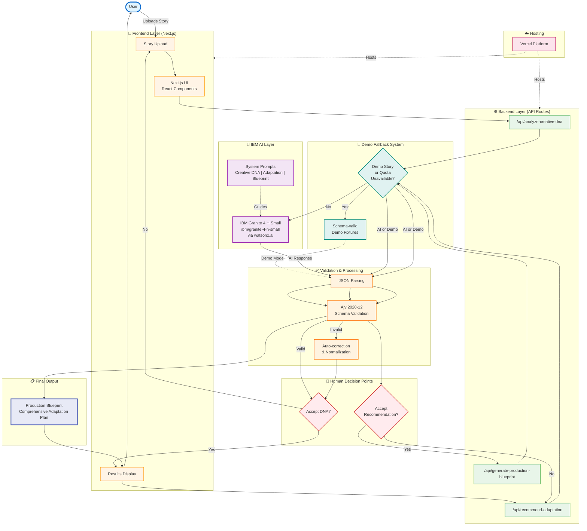

# Prism AI Adaptation Studio - Architecture

## System Architecture Diagram

## Legend

### Operating Modes

| Mode | Description | Trigger |
|------|-------------|---------|
| **🟢 Live Mode** | Full AI pipeline using IBM Granite 4 H Small (ibm/granite-4-h-small) via watsonx.ai | Default for all stories when quota available |
| **🟡 Demo Mode** | Transparent fallback using pre-validated fixtures | Activated for included demo story OR when watsonx.ai quota unavailable |

### Data Flow

- **Solid arrows (→)**: Primary data flow through the system
- **Dashed arrows (⇢)**: Supporting relationships (hosting, guidance, fallback)

### Key Components

1. **Frontend Layer**: Next.js React application with user interface
2. **Backend Layer**: Three API routes handling the three-stage pipeline
3. **IBM AI Layer**: IBM Granite 4 H Small (ibm/granite-4-h-small) model accessed through watsonx.ai with specialized prompts
4. **Validation Layer**: JSON parsing, Ajv schema validation, and automatic correction
5. **Human Decision Points**: User acceptance gates between pipeline stages
6. **Demo Fallback**: Transparent system using schema-valid fixtures when needed
7. **Final Output**: Production Blueprint with comprehensive adaptation details
8. **Hosting**: Vercel platform hosting both frontend and backend

### Pipeline Stages

1. **Creative DNA Analysis**: Extract narrative elements, themes, and structure
2. **Adaptation Recommendation**: Suggest optimal format and approach
3. **Production Blueprint**: Generate comprehensive production plan

Each stage includes:
- AI generation or demo fallback
- JSON parsing and validation
- Automatic correction if needed
- Human acceptance decision
- Structured output to next stage
